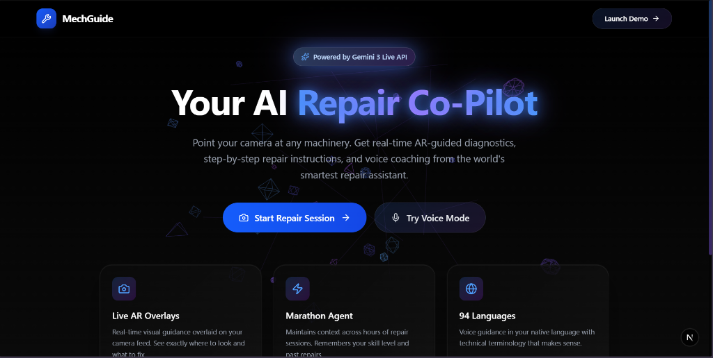
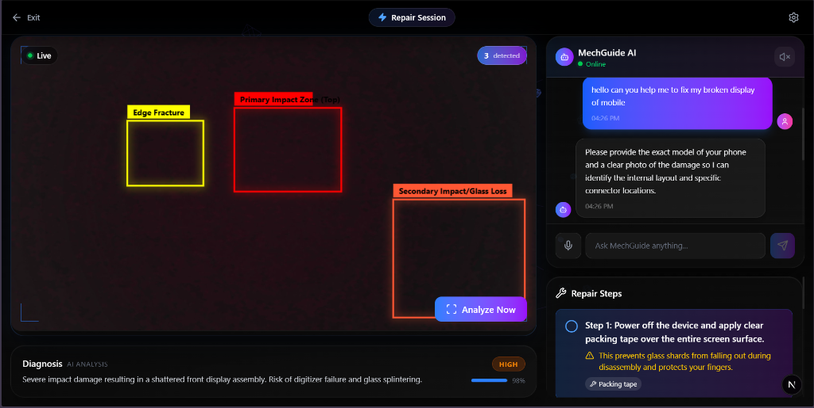

# 🔧 MechGuide Agent

> **Your AI Repair Co-Pilot** — Real-time AR-guided diagnostics powered by Gemini 3

| | |
|---|---|
| **Project Name** | MechGuide - Your AI Repair Co-Pilot |
| **Hackathon** | Gemini 3 Hackathon |
| **Organizer** | Devpost |
| **Hackathon URL** | [Event Page](https://gemini3.devpost.com/?ref_feature=challenge&ref_medium=your-open-hackathons&ref_content=Submissions+open) |
| **Team Lead** | Divyanshu Patel |

<div align="center">
  
  <br/><br/>
  
</div>


## 🎯 What It Does

MechGuide Agent transforms how anyone diagnoses and fixes machinery using smartphone cameras and Gemini 3's multimodal reasoning. Point your camera at any machine—vehicles, appliances, electronics—and get:

- **🎯 Live AR Overlays** — Bounding boxes highlighting components and issues
- **🗣️ Voice Guidance** — Step-by-step repair instructions spoken aloud
- **🧠 Marathon Agent** — Maintains context across long repair sessions
- **📋 Smart Checklists** — Auto-generated repair steps with safety warnings

## 🚀 Quick Start

### 1. Get Your Free Gemini API Key
Visit [aistudio.google.com](https://aistudio.google.com/) and create a free API key.

### 2. Setup
```bash
# Clone and install
cd mech-guide
npm install

# Add your API key
cp .env.example .env.local
# Edit .env.local and add your key:
# NEXT_PUBLIC_GEMINI_API_KEY=your_key_here

# Run dev server
npm run dev
```

### 3. Open the App
Navigate to [http://localhost:3000](http://localhost:3000) and click **"Start Repair Session"**!

## 🛠️ Tech Stack

| Technology | Purpose |
|------------|---------|
| **Next.js 16** | React framework with App Router |
| **Gemini 3 API** | Multimodal vision & reasoning |
| **Framer Motion** | Smooth animations |
| **Tailwind CSS v4** | Glassmorphism styling |
| **Web Speech API** | Voice input/output |

## 📁 Project Structure

```
mech-guide/
├── app/
│   ├── page.tsx          # Landing page
│   ├── repair/page.tsx   # Main repair interface
│   └── globals.css       # Glassmorphism styles
├── components/
│   ├── CameraFeed.tsx    # Webcam + AR overlay canvas
│   ├── ChatPanel.tsx     # Voice-enabled chat
│   └── RepairSteps.tsx   # Animated checklist
├── lib/
│   └── gemini.ts         # Gemini API client
└── types/
    └── speech.d.ts       # Web Speech API types
```

## 🎬 Demo Flow

1. **User opens app** → Premium landing page with glassmorphism
2. **Clicks "Start Repair Session"** → Camera activates
3. **Points at machinery** → Gemini analyzes every 3 seconds
4. **AR overlays appear** → Bounding boxes on detected issues
5. **Voice guidance speaks** → "I detect a loose belt..."
6. **Repair steps generate** → Checklist with safety warnings
7. **User completes repair** → Step-by-step with verification

## 🏆 Hackathon Tracks

- **🧠 Marathon Agent** — Multi-step reasoning with context
- **👨‍🏫 Real-Time Teacher** — Live video analysis & voice coaching
- **🎨 Creative Autopilot** — AR overlays with precision guidance

## 📝 License

MIT License - Built for Gemini 3 Hackathon 2026
